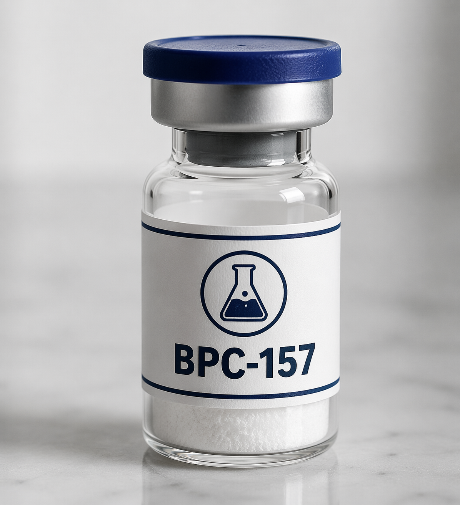
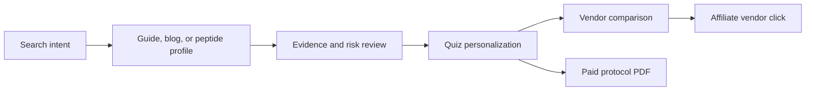

# PeptidePros

[](https://peptidepros.io/peptides)
[](https://peptidepros.io/vendors)
[](https://nextjs.org/)
[](https://peptidepros.io/sitemap.xml)

**PeptidePros** is an independent peptide research, comparison, and planning platform for people evaluating research-use-only peptide compounds, vendor documentation, COA quality, regulatory flags, and protocol-fit decisions.

Start here: [PeptidePros peptide research directory](https://peptidepros.io/peptides)



## What PeptidePros Helps With

PeptidePros is built around revenue-focused, search-friendly research paths:

- [Peptide profiles](https://peptidepros.io/peptides) with evidence tiers, risk levels, WADA flags, FDA compounding context, related goals, vendor options, and protocol decision support.
- [Peptide vendor comparison](https://peptidepros.io/vendors) with COA access notes, shipping fit, affiliate disclosures, and conservative trust rationale.
- [Peptide guides](https://peptidepros.io/guides) for RUO compliance, safety basics, reconstitution, COA review, and vendor evaluation.
- [Peptide comparison pages](https://peptidepros.io/compare/peptides) for compound-vs-compound research intent.
- [Peptide tools](https://peptidepros.io/tools) for cost planning, reconstitution math, conversion, dosing cadence, WADA checks, and COA review.
- [Personalized peptide quiz](https://peptidepros.io/quiz) that maps user goals to research paths, vendor options, and paid protocol products.

> PeptidePros does not sell peptides and does not provide medical advice. The site is designed for educational research comparison, compliance-aware decision support, and vendor documentation review.

## Popular Research Pages

These pages are the strongest public entry points for backlinks, citations, and search discovery:

| Topic | Page |
| --- | --- |
| BPC-157 research profile | [BPC-157 peptide guide](https://peptidepros.io/peptides/bpc-157) |
| TB-500 research profile | [TB-500 peptide guide](https://peptidepros.io/peptides/tb-500) |
| KPV research profile | [KPV peptide guide](https://peptidepros.io/peptides/kpv) |
| Tesamorelin research profile | [Tesamorelin peptide guide](https://peptidepros.io/peptides/tesamorelin) |
| Vendor research | [Peptide vendor comparison](https://peptidepros.io/vendors) |
| COA education | [How to read a peptide COA](https://peptidepros.io/guides/how-to-read-a-coa) |
| Vendor evaluation | [How to compare peptide vendors](https://peptidepros.io/guides/how-to-compare-peptide-vendors) |
| Safety basics | [Peptide safety basics](https://peptidepros.io/guides/peptide-safety-basics) |
| Personalized recommendations | [Peptide quiz](https://peptidepros.io/quiz) |

## Product Flow



## SEO And Trust Architecture

The app is structured for crawlable, high-intent pages rather than generic generated content:

- Dynamic `sitemap.xml` from the Next.js App Router.
- Canonical apex URLs at `https://peptidepros.io`.
- Noindex filtering for private, checkout, dashboard, outbound, and low-value generated surfaces.
- Editorial trust modules with author, reviewer, methodology, disclaimers, and source lists.
- Structured content templates for peptides, guides, blog posts, demographic pages, vendors, tools, and comparison pages.
- Code-native visuals for evidence/risk matrices, COA annotations, protocol timelines, and decision flows.
- Revenue attribution hooks for quiz starts, vendor clicks, checkout events, and paid protocol conversion.

## Tech Stack

- Next.js 16 App Router
- React 19
- TypeScript
- Tailwind CSS
- Supabase
- Stripe
- Vercel-ready deployment

## Local Development

```bash
npm install
npm run dev
```

Open `http://localhost:3000`.

## Validation

```bash
npm run build
npm run lint
npm run check:seo
```

`npm run check:seo` validates sitemap URLs and guards against broken indexable routes.

## Backlink Copy

Use this natural anchor when referencing the project:

> [PeptidePros is an independent peptide research directory and vendor comparison platform](https://peptidepros.io/) for evidence-graded peptide profiles, COA review, RUO compliance education, and personalized peptide planning.

Relevant deep links:

- [Peptide research directory](https://peptidepros.io/peptides)
- [Peptide vendor comparison](https://peptidepros.io/vendors)
- [How to read a peptide COA](https://peptidepros.io/guides/how-to-read-a-coa)
- [Peptide quiz and planning tool](https://peptidepros.io/quiz)
